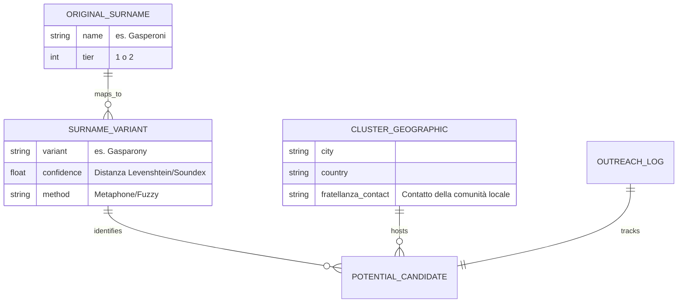

# TITAN VERITAS v5.0: The Rosetta Stone & Active Outreach

## 1. Valutazione Criticità Architetturali

### Rate Limiting & Stealth (Archivi Storici)
I portali come Ellis Island o i registri CEMLA hanno protezioni anti-scraping robuste. L'uso di `httpx` standard potrebbe non bastare.
- **Rischio:** IP Ban immediato. 
- **Soluzione:** Utilizzeremo una rotazione di user-agent e, se necessario, sessioni persistenti che mimano il comportamento umano, oppure l'integrazione di servizi proxy-less se il volume lo richiede.

### Distanza Fonetica (Entropy Management)
Mappare "Gasperoni" a "Gasparony" via Soundex/Metaphone è potente ma produce rumore.
- **Rischio:** Over-matching (es. mappare un cognome polacco a uno sammarinese per pura coincidenza fonetica).
- **Soluzione:** Implementeremo un **Confidence Score** combinato: `FuzzyMatch % + Cluster Geografico Context`. Se il match è fonetico ma avviene in una città senza cluster storico, lo score viene penalizzato.

### Infrastruttura Asincrona & State Management
Il Modulo 3 (Outreach) è "stateful". Dobbiamo sapere se un'email ha ricevuto risposta per non inviare solleciti errati.
- **Soluzione:** Useremo un database SQLite locale per tracciare lo stato della conversazione (`PENDING`, `REPLIED`, `VALIDATED`).

---

## 2. Schema Database (The "Rosetta" Schema)

Useremo un approccio Relazionale (SQLite) per gestire le relazioni storiche.



---

## 3. Implementazione Modulo 3 (Active Scouting Core)

Iniziamo a strutturare l'ossatura per l'Outreach Automatizzato.

```python
# Struttura classi Modulo 3
class OutreachIntelligence:
    """Interfaccia Gmail, Gemini e Telegram"""
    pass

class CommunicationManager:
    """Gestisce l'invio e la ricezione di email localizzate"""
    pass

class SignalProcessor:
    """Usa l'LLM per estrarre anagrafiche dalle risposte testuali"""
    pass
```

---

## Verification Plan v5.0
1. **Module 1 Test:** Generare varianti per "Gasperoni" e verificare che "Gasparony" sia nel top 5% di confidenza.
2. **Module 3 Test:** Mock Gmail response -> LLM parsing -> Notifica Telegram.
